# Keyboard Navigation Graph - Session Replay

## Complete Tab Navigation Flow

```mermaid
graph TB
    Start([Page Load: PickerPage])
    
    %% PickerPage Navigation
    Start --> Header[Header: App Title & Theme Toggle]
    Header --> ProjectSearch[Project Search Input]
    ProjectSearch --> SortRecent[Sort: Recent Button]
    SortRecent --> SortName[Sort: A-Z Button]
    SortName --> SortMost[Sort: Most Button]
    SortMost --> ProjectList[Project List]
    
    %% Project List Items
    ProjectList --> P1[Project Row 1<br/>Tab=focus, Enter=select]
    P1 --> P2[Project Row 2]
    P2 --> P3[Project Row 3]
    P3 --> PN[Project Row N...]
    
    %% After Project Selection
    PN -.Select Project.-> SessionSearch[Session Search Input<br/>AUTO-FOCUS ON SELECT]
    SessionSearch --> SubAgentToggle{Sub-agents exist?}
    SubAgentToggle -->|Yes| SubAgentBtn[Show Sub-agents Button]
    SubAgentToggle -->|No| SessionList
    SubAgentBtn --> SessionList[Session List]
    
    %% Session List Items
    SessionList --> S1[SessionCard 1<br/>AUTO-FOCUS AFTER PROJECT SELECT<br/>Tab=focus, Enter=load]
    S1 --> S2[SessionCard 2]
    S2 --> S3[SessionCard 3]
    S3 --> SN[SessionCard N...]
    
    %% Navigate to ReplayPage
    SN -.Select Session.-> ReplayPage([LOAD: ReplayPage])
    
    %% ReplayPage Navigation
    ReplayPage --> RHeader[Header: Back Button]
    RHeader --> RMode[Mode Selector: Fixed/Compressed/Realtime]
    RMode --> RCompression{Compressed mode?}
    RCompression -->|Yes| RCompressionSlider[Compression Slider]
    RCompression -->|No| RSearch
    RCompressionSlider --> RSearch[Search Bar Input]
    RSearch --> RExport[Export Button]
    RExport --> RStats[Stats Button]
    RStats --> RWidthSlider[Width Slider]
    RWidthSlider --> RTheme[Theme Toggle]
    RTheme --> RFilterBar[Filter Bar]
    
    %% Filter Bar
    RFilterBar --> FAll[Filter: All Button]
    FAll --> FNone[Filter: None Button]
    FNone --> FHuman[Filter: Human]
    FHuman --> FClaude[Filter: Claude]
    FClaude --> FBash[Filter: Bash]
    FBash --> FWrite[Filter: Write]
    FWrite --> FEdit[Filter: Edit]
    FEdit --> FRead[Filter: Read]
    FRead --> FAgent[Filter: Agent]
    FAgent --> FSkills[Filter: Skills]
    FSkills --> FWeb[Filter: Web]
    FWeb --> FTasks[Filter: Tasks]
    FTasks --> FCommands[Filter: Commands]
    FCommands --> FHooks[Filter: Hooks]
    FHooks --> FReasoning[Filter: Reasoning]
    FReasoning --> FCompact[Filter: Compact]
    FCompact --> FErrors[Filter: Errors]
    FErrors --> FSummary[Filter: Summary]
    FSummary --> FPRs[Filter: PRs]
    FPRs --> FCurrentTurn[Filter: Current Turn Only]
    FCurrentTurn --> MainContent[Main Content Area]
    
    %% Main Content - Big Play Button
    MainContent --> PlayIconBig{Empty state?}
    PlayIconBig -->|Yes| BigPlay[Big Play Icon<br/>AUTO-FOCUS ON LOAD<br/>Tab=focus, Enter/Space=play]
    PlayIconBig -->|No| ControlBar
    BigPlay --> ControlBar[Controls Bar]
    
    %% Animator Controls
    ControlBar --> CtrlReset[Reset Button]
    CtrlReset --> CtrlPlay[Play/Pause Button<br/>AUTO-FOCUS ON LOAD]
    CtrlPlay --> CtrlTimeline[Timeline/Minimap<br/>Click/Keyboard arrows to scrub]
    CtrlTimeline --> CtrlSpeed[Speed Slider]
    CtrlSpeed --> CtrlDuration{Fixed mode?}
    CtrlDuration -->|Yes| CtrlDurationSlider[Duration Slider]
    CtrlDuration -->|No| StatsPanel
    CtrlDurationSlider --> StatsPanel{Stats open?}
    
    %% Stats Panel
    StatsPanel -->|Yes| StatsPanelContent[Stats Panel: Tool links, etc.]
    StatsPanel -->|No| EndReplay
    StatsPanelContent --> EndReplay([End of ReplayPage Tab Order])
    
    %% Navigate to ExportEditorPage
    RExport -.Click.-> ExportPage([LOAD: ExportEditorPage])
    
    %% ExportEditorPage Navigation
    ExportPage --> EHeader[Header: Back Button]
    EHeader --> ETheme[Theme Toggle]
    ETheme --> EInBtn[In Point Button]
    EInBtn --> EOutBtn[Out Point Button]
    EOutBtn --> EClearBtn[Clear Clip Button]
    EClearBtn --> EPreviewSlider[Preview Slider]
    EPreviewSlider --> EFormat[Format Dropdown: MP4/WebM/GIF/JSON]
    EFormat --> EFPS[FPS Slider]
    EFPS --> EQuality{Format is GIF?}
    EQuality -->|Yes| EGIFQuality[GIF Quality Slider]
    EQuality -->|No| EResolution
    EGIFQuality --> EResolution[Resolution Slider]
    EResolution --> EExportBtn[Export Button / Download Link]
    EExportBtn --> ECanvas[Preview Canvas Area]
    ECanvas --> EndExport([End of ExportEditorPage Tab Order])
    
    %% Navigate to EditorPage
    ExportPage -.Alternative.-> EditorPage([LOAD: EditorPage])
    
    %% EditorPage Navigation
    EditorPage --> EdHeader[Header: Back Button]
    EdHeader --> EdSelect[Tool: Select]
    EdSelect --> EdText[Tool: Text]
    EdText --> EdArrow[Tool: Arrow]
    EdArrow --> EdRect[Tool: Rect]
    EdRect --> EdPreview[Mode: Preview]
    EdPreview --> EdEdit[Mode: Edit]
    EdEdit --> EdExport[Export Button]
    EdExport --> EdTheme[Theme Toggle]
    EdTheme --> EdCanvas[Editor Canvas<br/>Click to select clips/annotations]
    EdCanvas --> EdTimeline[Timeline Area<br/>Drag clips, scrub]
    EdTimeline --> EdProperties{Clip/Annotation selected?}
    EdProperties -->|Yes| EdPropsPanel[Properties Panel: Duration, Speed, etc.]
    EdProperties -->|No| EndEditor
    EdPropsPanel --> EndEditor([End of EditorPage Tab Order])
    
    %% Back Navigation
    EndReplay -.Back Button.-> Start
    EndExport -.Back Button.-> ReplayPage
    EndEditor -.Back Button.-> Start
    
    %% Styling
    classDef autoFocus fill:#58a6ff,stroke:#1f6feb,stroke-width:3px,color:#000
    classDef userAction fill:#3fb950,stroke:#1a7f37,stroke-width:2px
    classDef pageNode fill:#d29922,stroke:#9a6700,stroke-width:3px
    
    class S1,BigPlay,CtrlPlay autoFocus
    class P1,S1,RExport pageNode
    class Start,ReplayPage,ExportPage,EditorPage pageNode

```

## Keyboard Shortcuts Reference

### Global Navigation
- **Tab**: Move forward through focusable elements
- **Shift+Tab**: Move backward through focusable elements
- **Enter/Space**: Activate buttons, links, and interactive elements

### ReplayPage Specific
- **Space**: Play/Pause replay
- **← / →**: Step backward/forward one step
- **Home**: Jump to first step
- **End**: Jump to last step
- **Page Up**: Jump back 10 steps
- **Page Down**: Jump forward 10 steps
- **Scroll wheel** (on timeline): Scrub through steps

### Focus Jump Points (Auto-Focus)
1. **Project → Session**: After selecting a project, first session auto-focuses
2. **Session → Play**: After loading a session, Play button auto-focuses
3. **Initial Load**: On fresh page load, first project is tab-accessible

### Theme Toggle
- Available on **every page** (rightmost header element)
- **Tab** to reach, **Enter/Space** to toggle
- Sliding switch: 🌙 (left) = Dark, ☀️ (right) = Light

## Navigation Principles

### Focus Management
- **Logical flow**: Top-to-bottom, left-to-right
- **Skip repetition**: Auto-focus jumps over intermediate elements
- **Visual feedback**: 2px blue outline on all focused elements
- **No keyboard traps**: Can always Tab/Shift+Tab out of any section

### ARIA Support
- All interactive elements have proper `role` attributes
- `aria-label` on all buttons for screen reader context
- `aria-pressed` for toggle states
- `aria-checked` for theme toggle switch

## Complete Tab Order Summary

### PickerPage (45+ tabbable elements)
1. Theme toggle
2. Project search input
3. 3 sort buttons
4. N project rows
5. Session search input (after project select)
6. Sub-agents toggle (if applicable)
7. M session cards

### ReplayPage (30-50+ tabbable elements)
1. Back button
2. Mode selector
3. Compression slider (conditional)
4. Search input
5. Export button
6. Stats button
7. Width slider
8. Theme toggle
9. 17 filter buttons
10. Big play icon (empty state) OR control buttons
11. Timeline/minimap (interactive)
12. Speed slider
13. Duration slider (conditional)
14. Stats panel content (conditional)

### ExportEditorPage (15-20 tabbable elements)
1. Back button
2. Theme toggle
3. In/Out point buttons
4. Preview slider
5. Format dropdown
6. FPS slider
7. Quality/Resolution sliders
8. Export button

### EditorPage (20-30+ tabbable elements)
1. Back button
2. 4 annotation tools
3. 2 mode buttons
4. Export button
5. Theme toggle
6. Canvas (click-to-select)
7. Timeline (drag-to-move)
8. Properties panel (conditional)

---

**Total Tabbable Elements**: ~110-165 elements depending on page and state

**All elements are keyboard accessible with no mouse required!**
